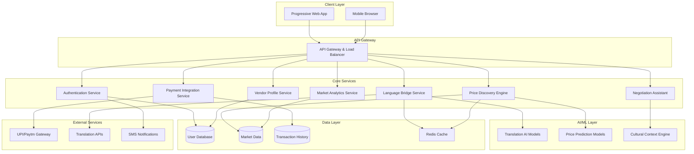

# Design Document: Local Vendor AI Marketplace

## Overview

The Local Vendor AI Marketplace is a web-based platform that bridges communication and pricing gaps in India's local markets through AI-powered tools. The system provides real-time multilingual translation, AI-driven price discovery, and culturally-sensitive negotiation assistance while respecting traditional market practices.

The platform follows a microservices architecture with separate services for translation, price discovery, negotiation assistance, and payment processing. The frontend is built as a Progressive Web App (PWA) optimized for mobile devices, ensuring accessibility in market environments with varying network conditions.

## Architecture

### High-Level Architecture



### Technology Stack

**Frontend:**
- Progressive Web App (PWA) using React/Next.js
- Responsive design with Tailwind CSS
- WebRTC for real-time voice communication
- Service Workers for offline functionality
- IndexedDB for local data storage

**Backend:**
- Node.js with Express.js for API services
- WebSocket connections for real-time features
- JWT-based authentication with refresh tokens
- Rate limiting and request validation

**AI/ML Services:**
- Python-based microservices using FastAPI
- TensorFlow/PyTorch for custom ML models
- Integration with Google Translate API and Reverie Language Technologies
- Redis for model caching and session management

**Database:**
- PostgreSQL for transactional data
- MongoDB for market analytics and logs
- Redis for caching and real-time sessions
- Elasticsearch for search functionality

**Infrastructure:**
- Docker containers with Kubernetes orchestration
- NGINX as reverse proxy and load balancer
- AWS/Azure cloud deployment with CDN
- Monitoring with Prometheus and Grafana

## Components and Interfaces

### Language Bridge Service

**Purpose:** Provides real-time multilingual translation with cultural context adaptation.

**Key Components:**
- **Translation Engine:** Integrates multiple translation APIs (Google Translate, Reverie) with fallback mechanisms
- **Cultural Context Processor:** Adapts translations based on local customs and market practices
- **Voice Processing Module:** Handles speech-to-text and text-to-speech conversion
- **Confidence Scorer:** Evaluates translation quality and flags uncertain translations

**API Interface:**
```typescript
interface LanguageBridgeAPI {
  translateText(text: string, sourceLang: string, targetLang: string, context?: CulturalContext): Promise<TranslationResult>
  translateVoice(audioBlob: Blob, sourceLang: string, targetLang: string): Promise<VoiceTranslationResult>
  getSupportedLanguages(): Promise<Language[]>
  validateTranslation(translation: TranslationResult): Promise<ValidationResult>
}

interface TranslationResult {
  translatedText: string
  confidence: number
  culturalAdaptations: string[]
  alternativeTranslations: string[]
  requiresVerification: boolean
}
```

### Price Discovery Engine

**Purpose:** Analyzes market data to provide fair pricing recommendations and real-time price updates.

**Key Components:**
- **Market Data Collector:** Aggregates pricing data from various sources and user transactions
- **Price Prediction Model:** ML model trained on historical data, seasonal patterns, and market conditions
- **Fair Price Calculator:** Determines price ranges based on location, vendor reputation, and product quality
- **Market Trend Analyzer:** Identifies pricing patterns and anomalies

**API Interface:**
```typescript
interface PriceDiscoveryAPI {
  getPriceRecommendation(product: ProductInfo, vendor: VendorInfo, location: LocationInfo): Promise<PriceRecommendation>
  updateMarketData(transaction: TransactionData): Promise<void>
  getMarketTrends(category: string, location: string, timeRange: TimeRange): Promise<MarketTrend[]>
  validatePricing(price: number, product: ProductInfo): Promise<PriceValidation>
}

interface PriceRecommendation {
  suggestedPrice: number
  priceRange: { min: number, max: number }
  confidence: number
  reasoning: string[]
  marketFactors: MarketFactor[]
  seasonalAdjustments: number
}
```

### Negotiation Assistant Service

**Purpose:** Facilitates fair and culturally-appropriate price negotiations between vendors and buyers.

**Key Components:**
- **Negotiation Session Manager:** Handles real-time negotiation sessions with state management
- **Cultural Negotiation Guide:** Provides guidance based on local customs and practices
- **Fairness Evaluator:** Assesses offer fairness using market data and pricing models
- **Compromise Suggester:** Proposes middle-ground solutions during impasses

**API Interface:**
```typescript
interface NegotiationAPI {
  startNegotiation(vendorId: string, buyerId: string, productId: string): Promise<NegotiationSession>
  submitOffer(sessionId: string, offer: NegotiationOffer): Promise<NegotiationResponse>
  getCulturalGuidance(sessionId: string, action: string): Promise<CulturalGuidance>
  suggestCompromise(sessionId: string): Promise<CompromiseSuggestion>
  finalizeAgreement(sessionId: string, terms: AgreementTerms): Promise<Agreement>
}

interface NegotiationSession {
  sessionId: string
  participants: Participant[]
  currentOffer: NegotiationOffer
  negotiationHistory: NegotiationEvent[]
  culturalContext: CulturalContext
  status: 'active' | 'paused' | 'completed' | 'cancelled'
}
```

### Vendor Profile Service

**Purpose:** Manages vendor profiles, reputation scores, and business verification.

**Key Components:**
- **Profile Manager:** Handles vendor registration, verification, and profile updates
- **Reputation Calculator:** Computes reputation scores based on transaction history and feedback
- **Verification System:** Manages business verification and document validation
- **Specialization Tracker:** Tracks vendor specialties and expertise areas

**API Interface:**
```typescript
interface VendorProfileAPI {
  createProfile(vendorData: VendorRegistration): Promise<VendorProfile>
  updateProfile(vendorId: string, updates: ProfileUpdate): Promise<VendorProfile>
  getProfile(vendorId: string): Promise<VendorProfile>
  calculateReputation(vendorId: string): Promise<ReputationScore>
  submitFeedback(transactionId: string, feedback: VendorFeedback): Promise<void>
  verifyBusiness(vendorId: string, documents: VerificationDocument[]): Promise<VerificationResult>
}

interface VendorProfile {
  vendorId: string
  businessInfo: BusinessInfo
  reputation: ReputationScore
  specializations: string[]
  verificationStatus: VerificationStatus
  marketPresence: MarketPresence
  culturalPreferences: CulturalPreference[]
}
```

### Payment Integration Service

**Purpose:** Handles payment processing through Indian payment systems with transaction recording.

**Key Components:**
- **UPI Integration Module:** Integrates with UPI payment systems and digital wallets
- **Transaction Recorder:** Records all payment transactions with detailed metadata
- **Payment Verification:** Validates payment completion and handles disputes
- **Currency Handler:** Manages currency conversion for international transactions

**API Interface:**
```typescript
interface PaymentAPI {
  initiatePayment(paymentRequest: PaymentRequest): Promise<PaymentSession>
  verifyPayment(transactionId: string): Promise<PaymentVerification>
  recordTransaction(transaction: TransactionRecord): Promise<void>
  getTransactionHistory(userId: string, filters: TransactionFilter): Promise<Transaction[]>
  handleDispute(transactionId: string, dispute: DisputeInfo): Promise<DisputeResolution>
}

interface PaymentRequest {
  amount: number
  currency: string
  vendorId: string
  buyerId: string
  productInfo: ProductInfo
  paymentMethod: 'UPI' | 'PAYTM' | 'CASH' | 'WALLET'
  negotiationSessionId?: string
}
```

## Data Models

### Core Entities

**User Model:**
```typescript
interface User {
  userId: string
  userType: 'vendor' | 'buyer' | 'intermediary'
  personalInfo: PersonalInfo
  preferences: UserPreferences
  securitySettings: SecuritySettings
  createdAt: Date
  lastActive: Date
}

interface PersonalInfo {
  name: string
  phoneNumber: string
  email?: string
  preferredLanguage: string
  location: LocationInfo
  profileImage?: string
}

interface UserPreferences {
  languages: string[]
  culturalSettings: CulturalPreference[]
  notificationSettings: NotificationSettings
  privacySettings: PrivacySettings
}
```

**Product Model:**
```typescript
interface Product {
  productId: string
  vendorId: string
  name: string
  description: string
  category: string
  subcategory: string
  images: string[]
  specifications: ProductSpecification[]
  basePrice: number
  availability: AvailabilityInfo
  tags: string[]
  createdAt: Date
  updatedAt: Date
}

interface ProductSpecification {
  attribute: string
  value: string
  unit?: string
  isNegotiable: boolean
}
```

**Transaction Model:**
```typescript
interface Transaction {
  transactionId: string
  vendorId: string
  buyerId: string
  productId: string
  negotiationSessionId?: string
  amount: number
  currency: string
  paymentMethod: string
  status: TransactionStatus
  timestamps: TransactionTimestamps
  metadata: TransactionMetadata
}

interface TransactionMetadata {
  location: LocationInfo
  negotiationDuration?: number
  culturalContext: CulturalContext
  priceDiscoveryData: PriceDiscoveryData
  feedbackSubmitted: boolean
}
```

**Market Data Model:**
```typescript
interface MarketData {
  dataId: string
  category: string
  subcategory: string
  location: LocationInfo
  pricePoints: PricePoint[]
  demandIndicators: DemandIndicator[]
  seasonalFactors: SeasonalFactor[]
  competitorAnalysis: CompetitorData[]
  timestamp: Date
}

interface PricePoint {
  price: number
  quantity: number
  vendorReputation: number
  transactionVolume: number
  timeOfDay: string
  dayOfWeek: string
}
```

## Error Handling

### Error Classification

**System Errors:**
- Translation service failures with automatic fallback to alternative providers
- Payment gateway timeouts with retry mechanisms and user notification
- Database connection issues with circuit breaker patterns
- AI model inference failures with graceful degradation

**User Errors:**
- Invalid input validation with clear error messages in user's preferred language
- Authentication failures with secure retry mechanisms
- Permission denied errors with appropriate guidance
- Network connectivity issues with offline mode activation

**Business Logic Errors:**
- Price validation failures with explanation and suggestions
- Negotiation rule violations with cultural context guidance
- Reputation threshold violations with improvement recommendations
- Payment verification failures with dispute resolution options

### Error Response Format

```typescript
interface ErrorResponse {
  error: {
    code: string
    message: string
    localizedMessage: string
    details?: any
    suggestions?: string[]
    retryable: boolean
    timestamp: Date
  }
}
```

### Fallback Mechanisms

**Translation Fallbacks:**
1. Primary: Google Translate API
2. Secondary: Reverie Language Technologies
3. Tertiary: Cached translations
4. Final: Basic keyword matching with user notification

**Payment Fallbacks:**
1. Primary: UPI direct integration
2. Secondary: Paytm gateway
3. Tertiary: Manual cash transaction recording
4. Final: Offline transaction logging with later synchronization

**Price Discovery Fallbacks:**
1. Primary: Real-time ML model predictions
2. Secondary: Historical average pricing
3. Tertiary: Category-based pricing templates
4. Final: Manual price entry with validation

## Testing Strategy

The testing strategy employs a dual approach combining unit tests for specific scenarios and property-based tests for comprehensive validation of universal properties.

**Unit Testing Focus:**
- API endpoint validation with various input scenarios
- Authentication and authorization edge cases
- Payment integration error handling
- Cultural context adaptation examples
- Database transaction integrity
- Real-time communication reliability

**Property-Based Testing Focus:**
- Universal properties derived from acceptance criteria
- Comprehensive input coverage through randomization
- Minimum 100 iterations per property test
- Each test tagged with corresponding design property

**Testing Configuration:**
- Jest for unit testing with React Testing Library for frontend
- Property-based testing using fast-check library
- Integration testing with Testcontainers for database testing
- End-to-end testing with Playwright for critical user flows
- Performance testing with k6 for load scenarios
- Security testing with OWASP ZAP for vulnerability scanning

**Test Environment:**
- Staging environment mirroring production configuration
- Mock services for external API dependencies
- Test data generation for various market scenarios
- Automated CI/CD pipeline with comprehensive test coverage

## Correctness Properties

*A property is a characteristic or behavior that should hold true across all valid executions of a system—essentially, a formal statement about what the system should do. Properties serve as the bridge between human-readable specifications and machine-verifiable correctness guarantees.*

### Translation and Communication Properties

**Property 1: Universal Translation Coverage**
*For any* buyer language selection and vendor communication, the Language_Bridge should translate all communications in real-time, supporting both text and voice input in both directions
**Validates: Requirements 1.1, 1.4**

**Property 2: Translation Performance Guarantee**
*For any* vendor speech input in their local language, the Language_Bridge should convert it to the buyer's language within 2 seconds
**Validates: Requirements 1.2**

**Property 3: Cultural Context Preservation**
*For any* translation requiring cultural context, the Cultural_Context_Engine should adapt the translation to preserve meaning and cultural respect
**Validates: Requirements 1.3**

**Property 4: Translation Confidence Monitoring**
*For any* translation with confidence below 85%, the Language_Bridge should flag it as uncertain and request clarification
**Validates: Requirements 1.5**

### Price Discovery Properties

**Property 5: Comprehensive Price Analysis**
*For any* product listing, the Price_Discovery_Engine should analyze current market data and consider all relevant factors (location, vendor reputation, product quality) to suggest a Fair_Price_Range
**Validates: Requirements 2.1, 2.4**

**Property 6: Real-time Price Updates**
*For any* market condition change, the Price_Discovery_Engine should update price recommendations within 5 minutes
**Validates: Requirements 2.2**

**Property 7: Historical Data Integration**
*For any* pricing calculation where historical data is available, the Price_Discovery_Engine should factor in seasonal trends and demand patterns
**Validates: Requirements 2.3**

**Property 8: Price Reasoning Transparency**
*For any* price suggestion generated, the Price_Discovery_Engine should provide transparent reasoning for the recommendations
**Validates: Requirements 2.5**

### Negotiation Properties

**Property 9: Negotiation Session Management**
*For any* negotiation initiation, the Negotiation_Assistant should establish a Market_Session with both parties
**Validates: Requirements 3.1**

**Property 10: Offer Fairness Evaluation**
*For any* offer exchange during negotiation, the Negotiation_Assistant should evaluate fairness based on current market data
**Validates: Requirements 3.2**

**Property 11: Cultural Negotiation Guidance**
*For any* negotiation where cultural norms apply, the Negotiation_Assistant should guide participants according to local customs
**Validates: Requirements 3.3**

**Property 12: Impasse Resolution**
*For any* negotiation impasse, the Negotiation_Assistant should suggest compromise solutions within the Fair_Price_Range
**Validates: Requirements 3.4**

**Property 13: Agreement Documentation**
*For any* reached agreement, the Negotiation_Assistant should document the final terms and pricing
**Validates: Requirements 3.5**

### Vendor Profile Properties

**Property 14: Profile Creation Completeness**
*For any* vendor registration, the System should create a profile with basic business information and verification status
**Validates: Requirements 4.1**

**Property 15: Transaction Rating Availability**
*For any* completed transaction, the System should allow buyers to rate vendors on quality, fairness, and service
**Validates: Requirements 4.2**

**Property 16: Reputation Score Weighting**
*For any* reputation score calculation, the System should weight recent transactions more heavily than older ones
**Validates: Requirements 4.3**

**Property 17: Profile Information Display**
*For any* vendor profile, the System should display vendor specialties, years of experience, and customer feedback prominently
**Validates: Requirements 4.4**

**Property 18: Reputation Threshold Monitoring**
*For any* vendor whose reputation score falls below acceptable thresholds, the System should flag them for review
**Validates: Requirements 4.5**

### Market Analytics Properties

**Property 19: Comprehensive Data Collection**
*For any* market operation, the System should collect and analyze pricing data across different product categories and locations
**Validates: Requirements 5.1**

**Property 20: Report Insights Generation**
*For any* generated report, the System should provide insights on price trends, demand patterns, and market dynamics
**Validates: Requirements 5.2**

**Property 21: Seasonal Pattern Recognition**
*For any* market data where seasonal variations exist, the System should highlight cyclical pricing patterns and optimal selling periods
**Validates: Requirements 5.3**

**Property 22: Privacy-Preserving Analytics**
*For any* aggregate market intelligence provided, the System should maintain data privacy while delivering insights
**Validates: Requirements 5.4**

**Property 23: Anomaly Detection and Alerting**
*For any* detected market anomaly, the System should alert relevant stakeholders about unusual market conditions
**Validates: Requirements 5.5**

### Cultural Sensitivity Properties

**Property 24: Cultural Factor Integration**
*For any* negotiation guidance or price suggestion, the System should incorporate local bargaining traditions, etiquette, and cultural factors that influence perceived value and fairness
**Validates: Requirements 6.1, 6.2**

**Property 25: Cultural Event Adaptation**
*For any* festival or special occasion, the System should adjust recommendations based on cultural significance
**Validates: Requirements 6.3**

**Property 26: Cultural Preference Management**
*For any* vendor, the System should allow specification of cultural preferences and traditional practices they wish to maintain
**Validates: Requirements 6.4**

**Property 27: Cultural Sensitivity Priority**
*For any* conflict between AI suggestions and cultural norms, the System should prioritize cultural sensitivity
**Validates: Requirements 6.5**

### Mobile Interface Properties

**Property 28: Mobile Responsiveness**
*For any* mobile device, the System should provide a responsive web interface optimized for that device
**Validates: Requirements 7.1**

**Property 29: Offline Functionality**
*For any* poor network connectivity situation, the System should function with basic features in offline mode
**Validates: Requirements 7.2**

**Property 30: Voice Interaction Feedback**
*For any* voice input usage, the System should provide clear audio feedback and confirmation
**Validates: Requirements 7.3**

**Property 31: Touch-Friendly Navigation**
*For any* user interaction, the System should support touch-friendly navigation suitable for busy market environments
**Validates: Requirements 7.4**

**Property 32: Haptic Feedback Provision**
*For any* critical action performed on supported devices, the System should provide haptic feedback
**Validates: Requirements 7.5**

### Transaction Management Properties

**Property 33: Complete Transaction Recording**
*For any* completed transaction, the System should record all relevant details including price, quantity, and participants
**Validates: Requirements 8.1**

**Property 34: Transaction History Access**
*For any* user request for transaction history, the System should provide searchable records with filtering options
**Validates: Requirements 8.2**

**Property 35: Dispute Resolution Data Access**
*For any* arising dispute, the System should provide access to documented negotiation history and agreed terms
**Validates: Requirements 8.3**

**Property 36: Privacy-Preserving Information Sharing**
*For any* transaction, the System should maintain privacy while allowing participants to share relevant details
**Validates: Requirements 8.4**

**Property 37: Personal Analytics Generation**
*For any* user report generation, the System should provide insights on personal buying/selling patterns and trends
**Validates: Requirements 8.5**

### Security Properties

**Property 38: Data Encryption Coverage**
*For any* personal data and communication, the System should encrypt it using industry-standard protocols
**Validates: Requirements 9.1**

**Property 39: Multi-Factor Authentication Implementation**
*For any* user registration, the System should implement multi-factor authentication for account security
**Validates: Requirements 9.2**

**Property 40: Financial Data Compliance**
*For any* payment information handling, the System should comply with relevant financial data protection regulations
**Validates: Requirements 9.3**

**Property 41: Granular Privacy Controls**
*For any* user, the System should provide granular privacy controls allowing management of data sharing preferences
**Validates: Requirements 9.4**

**Property 42: Security Breach Response**
*For any* detected security breach, the System should immediately notify affected users and take protective measures
**Validates: Requirements 9.5**

### Payment Integration Properties

**Property 43: Payment Platform Integration**
*For any* supported payment method (UPI, Paytm, digital wallets), the System should provide proper integration and functionality
**Validates: Requirements 10.1**

**Property 44: Real-time Payment Confirmation**
*For any* processed payment, the System should provide real-time confirmation to both parties
**Validates: Requirements 10.2**

**Property 45: Payment Dispute Mediation**
*For any* payment dispute, the System should provide mediation tools and transaction evidence
**Validates: Requirements 10.3**

**Property 46: Cash Transaction Support**
*For any* vendor preferring traditional payment methods, the System should support cash transaction recording
**Validates: Requirements 10.4**

**Property 47: Currency Conversion Handling**
*For any* international buyer participation, the System should handle currency conversion transparently
**Validates: Requirements 10.5**